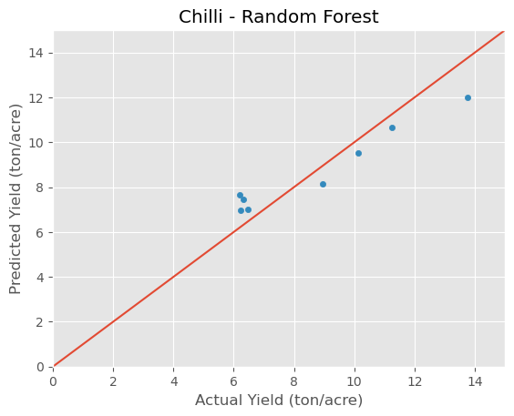

# Tomato and Chili Yield Prediction

## Project Overview

- The goal of this project is to develop a machine learning model that can accurately predict the yield for tomato and chili crops. The model will take into account various factors such as environmental conditions, soil characteristics, and cultivation practices to estimate the expected yield. The project is conducted for various.

## Data Description

The dataset used in this project consists of historical records of tomato and chili crops, including various features that influence yield. The data includes information such as:

    1 - Environmental factors: rainfall, windspeed, temperature, humidity.
    2 - Cultivation practices: irrigation frequency, fertilizer usage, planting density
    3 - Target variable: yield (in kilograms or tons per acre)

## Feature Selection and Engineering

- Based on the insights from exploratory data analysis, a subset of relevant features was selected for model training. 

## Data Collection and Preprocessing

- The data was collected from the Murata company's sensor-based monitoring systems. Preprocessing steps included handling missing values, removing outliers, and converting to str to float columns. 

## Exploratory Data Analysis

Exploratory data analysis was conducted to gain insights into the dataset and understand the relationships between different features and the target variable. Key findings include:

    1 - Positive correlation between temperature and yield
    2 - Negative correlation between rainfall and yield during specific growth stages
    3 - Variations in yield based on maximum rainfall and age of the crop

## Model Development

- Various machine learning models were evaluated, including Multi-linear regression, decision trees and random forests. Cross-validation techniques were applied to assess model performance and tune hyperparameters. The selected model was then trained on the entire dataset using the optimized hyperparameters.

## Model Evaluation

- The trained model was evaluated using various metrics such as mean absolute error (MAE), root mean squared error (RMSE), and coefficient of determination (R-squared). The evaluation results indicated that the tomato model  & chili model achieved good performance in predicting yields with 
R-squared greater than 0.84.

#### Result of Tomato 

| Model | Mean absolute error | Correlation | Coefficient of determination R^2 |
|--- |--- |--- | --- |
| Random Forest Regressor | 1.51 | 0.98 |   0.87 |
| Support Vector Machine | 3.70 | 0.62 |   -0.05 |

#### Result of Chili

| Model | Mean absolute error | Correlation | Coefficient of determination R^2 |
|--- |--- |--- | --- |
| Random Forest Regressor | 0.96 | 0.98 |   0.85 |
| Support Vector Machine | 2.35 | 0.54 |   -0.07 |

# Results and Conclusions

The developed machine learning model demonstrates promising capabilities in predicting tomato and chili yields based on environmental and cultivation factors. The final results are 

###### tomato result
 

###### chili result

